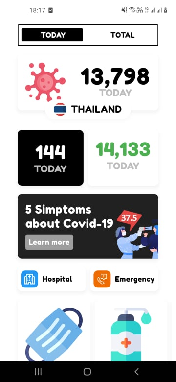
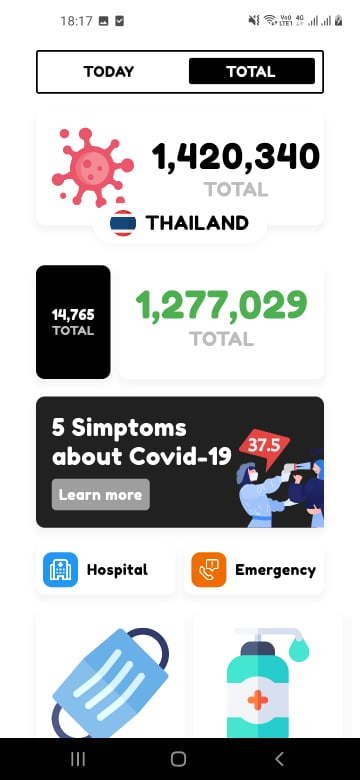
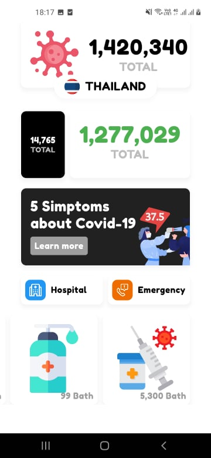

# Covid-19 Flutter

# Preview App

  
  
  

## Getting Started
Note: You already need to have Flutter installed.
<pre>
# clone the repo
git clone https://github.com/kai63001/covid19flutter.git 

# move to the cloned repo
cd covid19flutter

# get dependencies
flutter pub get

# run application
flutter run
</pre>
